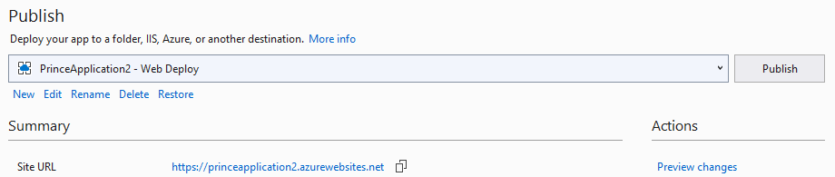
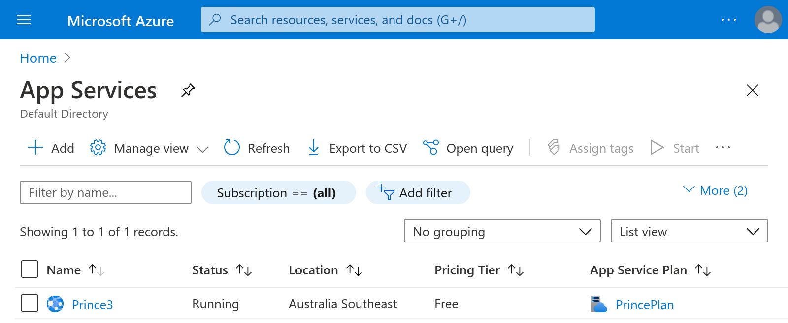

Prince Azure Example
====================

This is a Visual Studio 2019 project that demonstrates generating a PDF with
Prince in C# / ASP.NET Core.  It uses [the Prince C# / .Net Wrapper][dotnet-wrapper].
It has been confirmed to work when deployed as an [App Service] on Microsoft
Azure.

## Contents

* [Deploying to Microsoft Azure](#deploying-to-microsoft-azure)
* [Debugging](#debugging)
  * [Logs](#logs)
  * [Console](#console)
* [License](#license)

## Deploying to Microsoft Azure

Follow these steps to deploy this project to Microsoft Azure:

1. Clone the repository: `git clone https://github.com/yeslogic/azure-prince-example.git`
2. Open the project in Visual Studio, selecting the `PrinceApplication1.sln` file.
3. In the Solution Explorer, right-click on `PrinceApplication1` and choose "Publish...". 
   
4. In the Publish window that appears, select Azure as the Target and click "Next". 
   
5. Choose "Azure App Service (Windows)" as the Specific Target.
   
6. Create or sign in to your Azure account.
   When signed in, click "Create a new Azure App Service...". 
   
7. Pick a name, this will be used as the sub-domain when deployed.
   E.g. a name of `PrinceApplication2` gets deployed to https://princeapplication2.azurewebsites.net/.
   Choose a subscription, create or choose an existing resource group, and hosting plan.
   Click "Create", then click "Finish". 
   
8. Click the Publish button in the main Publish view. 
   
9. Your browser should open when publishing completes. Add `/prince` to the URL
   and you should see a PDF generated by Prince.

## Debugging

Two tools that are useful for debugging Prince in Azure are the logs
and the console. This section shows how to use these.

### Sign In and Navigate to Your App Service

1. Sign in to the [Azure portal] and navigate to App Services. 
   
2. Click on the App Service you want to inspect. 
   

### Logs

#### Enable Logging

Logs from the App Service can be viewed in the Azure portal. However, they
must be enabled first:

1. [Sign in and navigate to your App Service](#sign-in-and-navigate-to-your-app-service).
2. In the side bar click on "App Service Logs".
3. Enable "Application Logging (Filesystem)".
4. Set the Level to "Information", and click "Save". 
   
5. Wait for the notification that logging is enabled.

#### View Logs

1. [Sign in and navigate to your App Service](#sign-in-and-navigate-to-your-app-service).
2. In the side bar click on "Log stream". Now when new requests are made you
   will see the logs. 
   

### Console

1. [Sign in and navigate to your App Service](#sign-in-and-navigate-to-your-app-service).
2. In the side bar click on "Console". You can now run commands and inspect the
   deployed files. 
   

## License

The source code in this repository is licensed under the [Apache 2.0 license](LICENSE).

The [Inter font family][Inter] contained in
[PrinceApplication1/fonts](PrinceApplication1/fonts) is Copyright 2016-2020 The
Inter Project Authors. "Inter" is trademark of Rasmus Andersson.
This Font Software is licensed under the SIL
Open Font License, Version 1.1.  See
[PrinceApplication1/fonts/LICENSE](PrinceApplication1/fonts/LICENSE).

[Inter]: https://github.com/rsms/inter
[dotnet-wrapper]: https://www.princexml.com/doc/server-integration/#the-c-net-wrapper-
[App Service]: https://azure.microsoft.com/en-us/services/app-service/
[Azure portal]: https://portal.azure.com/
